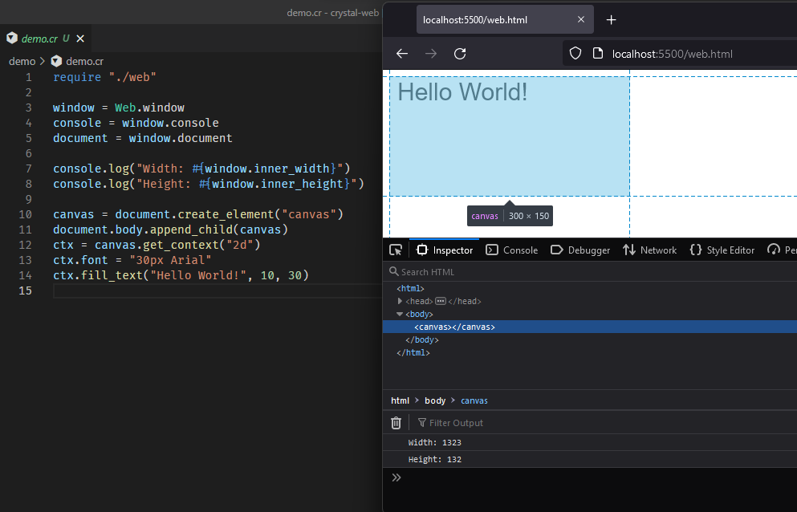

# crystal-web

This shard provides bindings to Web APIs on top of [`crystal-js`](https://github.com/lbguilherme/crystal-js).

It is still experimental and very initial. Any help is welcome.

## Installation

1. Add the dependency to your `shard.yml`:

   ```yaml
   dependencies:
     web:
       github: lbguilherme/crystal-web
   ```

2. Run `shards install`

3. Build your project with `lib/js/scripts/build.sh src/main.cr` Use the `--release` flag for an optimized build. This will produce two files: a `main.wasm` and a `main.js`.

4. Add to your HTML file: `<script defer src="main.js"></script>`.

## Usage

```crystal
require "web"

window = Web.window
console = window.console
document = window.document

console.log "Width: #{window.inner_width}"
console.log "Height: #{window.inner_height}"

canvas = document.create_element("canvas")
document.body.append_child(canvas)
ctx = canvas.get_context("2d")
ctx.font = "30px Arial"
ctx.fill_text("Hello World!", 10, 30)
```


